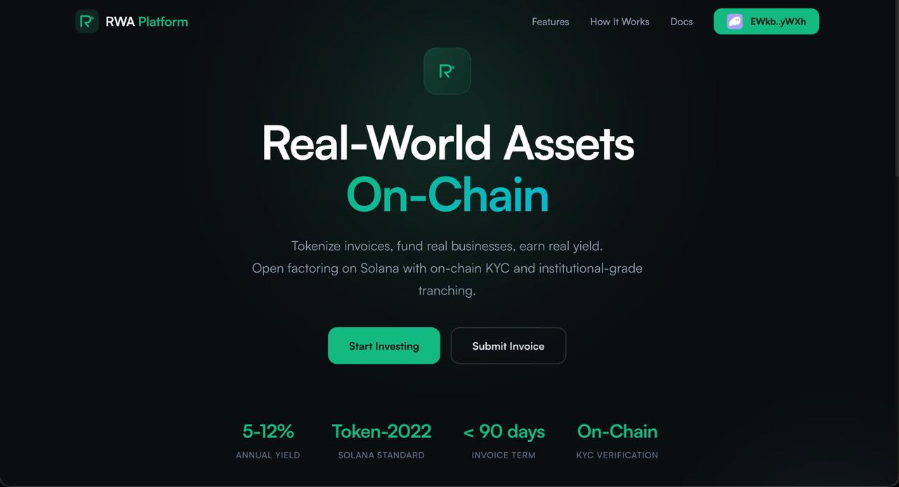

# FactorX — Open Factoring Protocol on Solana

[](LICENSE) [](https://solana.com) [](https://www.anchor-lang.com) [](https://colosseum.org)

> Tokenize short-term unsecured debt on Solana — small businesses sell invoices, global investors fund them with USDT, the platform advances 90% immediately. Built for AIFC/AFSA compliance with on-chain KYC via Sumsub and Token-2022 Transfer Hook enforcement.

[Video Demo](https://drive.google.com/drive/folders/1uVpJh88Lq05m0MJoEjVATh8YTlmruaoY) · [Colosseum Submission](https://arena.colosseum.org/projects/explore/factorx)

---



---

## Submission to 2026 Solana National Hackathon

| Name | Role | Telegram |
|------|------|---------|
| Dmitry Osipov | Full-Stack Blockchain Engineer |   @oscreed |
| Vladislav Pakhomov | Business Analyst / Bizdev Lead |  @riveretosango |
| Andrey Basharov | Product Lead | @ph_andreyy |
| Anton Ledrov | Full-Stack Blockchain Engineer | @lEdrov13 |

---

## Problem and Solution

### 1. Invoice Liquidity Gap
- **Problem:** Small businesses in Kazakhstan wait 30–90 days for invoice payment, starving working capital. Traditional factoring is slow, opaque, and inaccessible to global capital.
- **FactorX:** Tokenizes invoices as Token-2022 assets on Solana — creditors get 90% advance in minutes, not weeks.

### 2. No Transparent Yield for Investors
- **Problem:** DeFi yield often comes from speculative or opaque sources. Real-world debt instruments are locked behind institutional gatekeepers.
- **FactorX:** Two-tranche model (Senior 5% / Junior 12%) backed by real invoices with on-chain settlement and waterfall payout logic.

### 3. Compliance Barrier
- **Problem:** RWA protocols struggle with KYC/AML — either they ignore it (limiting adoption) or handle it off-chain (breaking composability).
- **FactorX:** On-chain KYC whitelist enforced at the protocol level via Token-2022 Transfer Hook. Every token transfer is checked — no exceptions.

### 4. Fragmented Invoice Verification
- **Problem:** Invoice authenticity is hard to verify across borders, leading to fraud and double-financing.
- **FactorX:** SHA-256 document hashing on-chain + integration with Kazakhstan's electronic document exchange (EDO) system for independent verification.

---

## Why Solana

- **Speed** — Sub-second finality makes real-time invoice funding and settlement practical
- **Cost** — $0.00025/tx allows micro-investments and frequent settlement without fee erosion
- **Token-2022** — Native Transfer Hooks enable protocol-level KYC enforcement without wrapper contracts or custom token standards
- **Composability** — Anchor CPI allows FactorX to integrate with any Solana DeFi protocol for future liquidity routing

---

## Summary of Features

- Two-tranche investment model (Senior / Junior) with configurable APY pools
- Full invoice lifecycle on-chain: Funding → Funded → Advanced → Repaid → Claimed
- Token-2022 Transfer Hook enforces KYC on every token transfer
- Sumsub KYC integration with automatic on-chain whitelist management
- Mock EDO import for Kazakhstan electronic document exchange
- Waterfall payout: Senior investors paid first, Junior absorbs risk
- Real-time portfolio tracking with claim functionality
- Three role-based interfaces: Investor, Creditor, Admin

---

## Tech Stack

| Layer | Technology |
|-------|-----------|
| On-chain Program | Rust · Anchor 0.31 · Token-2022 (TransferHook, MetadataPointer) |
| Backend | Node.js · TypeScript · Express · @coral-xyz/anchor |
| Frontend | React 18 · Vite · @solana/wallet-adapter · React Router |
| KYC | Sumsub WebSDK + Webhooks (mock mode for devnet) |
| Validation | Zod · SHA-256 document hashing |
| Testing | Anchor Tests · ts-mocha (14 lifecycle tests) |

---

## Architecture

```
┌─────────────────────────────────────────────────────────────┐
│  Frontend (React 18 + Vite)                                 │
│  Roles: Investor / Creditor / Admin                         │
│  Wallet: Phantom via @solana/wallet-adapter                 │
├─────────────┬───────────────────────────────┬───────────────┤
│  Investor   │  Creditor                     │  Admin        │
│  Marketplace│  Submit Invoice / EDO Import  │  Advance /    │
│  Fund / Claim│  Dashboard                   │  Settle /     │
│  Portfolio  │                               │  Pools / KYC  │
├─────────────┴───────────────────────────────┴───────────────┤
│  Backend (Express + TypeScript)                             │
│  KYC: Sumsub WebSDK + Webhooks (mock mode without keys)    │
│  EDO: Mock electronic document exchange (Kazakhstan)        │
│  Oracle: Authorized keypair for privileged on-chain calls   │
├─────────────────────────────────────────────────────────────┤
│  Solana Program (Anchor 0.31, Token-2022)                   │
│  ┌──────────────┐ ┌──────────┐ ┌─────────┐ ┌────────────┐  │
│  │ TransferHook │ │ Whitelist│ │  Pools  │ │  Invoices  │  │
│  │ KYC enforce  │ │ Registry │ │ Sr / Jr │ │  Lifecycle │  │
│  └──────────────┘ └──────────┘ └─────────┘ └────────────┘  │
└─────────────────────────────────────────────────────────────┘
```

### On-chain PDA Structure

| PDA | Seeds | Purpose |
|-----|-------|---------|
| WhitelistRegistry | `["whitelist_registry"]` | Singleton — authority + verified wallet count |
| WhitelistEntry | `["whitelist_entry", wallet]` | Per-wallet KYC record (kyc_id, country_code, is_active) |
| PoolConfig | `["pool_config", risk_level]` | Per-tranche config: Senior (0) = 5%, Junior (1) = 12% |
| InvoiceAccount | `["invoice", invoice_id]` | Invoice state, vault authority, linked Token-2022 mint |
| InvestorPosition | `["investor", invoice_id, wallet]` | Investor deposit: amount, tranche, rate, claim status |

### Invoice Lifecycle

```
Funding → Funded → Advanced → Repaid → (Investor Claims)
                  ↘ Defaulted (tokens remain as proof-of-debt)
```

---

## Quick Start

**Prerequisites:** Rust 1.85+, Solana CLI (Agave) 3.1.x, Anchor CLI 0.31.x, Node.js 20+, Yarn

```bash
# Clone the repository
git clone https://github.com/AntonLED/rwa-platform
cd rwa-platform

# Install toolchain 
# Rust
curl --proto '=https' --tlsv1.2 -sSf https://sh.rustup.rs | sh
rustup default stable

# Agave (Solana CLI)
agave-install init 3.1.11

# Anchor CLI
cargo install --git https://github.com/coral-xyz/anchor --tag v0.31.0 anchor-cli

# Node
yarn install

# Set up Solana (shared devnet keypair included in repo)
solana config set --url devnet
solana config set --keypair keys/devnet-authority.json
solana airdrop 2

# Build and deploy smart contract
anchor build
# yarn copy-idl      # IDL already in git, run if the contract changed
# anchor deploy      # program already in devnet, run if the contract chainged

# Initialize devnet (registry + pools + mock USDT)
anchor run init-devnet

# Start backend (Terminal 1)
cd backend && cp .env.example .env && yarn dev

# Start frontend (Terminal 2)
cd frontend && yarn dev
```

Open `http://localhost:5173`, connect Phantom wallet, pass KYC (mock mode — instant approval).

Anchor-tests if needed: 
```bash
anchor test --provider.cluster localnet

# if validator already running
anchor test --skip-local-validator
```

## Troubleshooting

1. If you got an error in 7th step of `anchor run init-devnet` like `Authority faucet error` pls rerun `anchor run init-devnet` cause devnet is unstable. 

---

## Roadmap

- [x] Core smart contract — 11 instructions, 5 PDA types, Transfer Hook
- [x] Two-tranche investment model (Senior / Junior)
- [x] Full invoice lifecycle (fund → advance → settle → claim)
- [x] Sumsub KYC integration with on-chain whitelist
- [x] Mock EDO integration (Kazakhstan e-document exchange)
- [x] Three role-based frontend views
- [x] 14 Anchor lifecycle tests
- [ ] Mainnet deployment
- [ ] Real EDO/ERP integration (1C, SAP)
- [ ] Secondary market for invoice tokens
- [ ] Multi-currency support (KZT stablecoin)
- [ ] Credit scoring oracle integration
- [ ] Mobile app (React Native)

---

## Resources

- [Project Presentation](https://drive.google.com/drive/folders/1fEIue7iQ_vbTg6OtDoi4CKApRDPTKFk5?usp=drive_link)
- [Video Demo](https://drive.google.com/drive/folders/1uVpJh88Lq05m0MJoEjVATh8YTlmruaoY)

---

## License

MIT — see [LICENSE](LICENSE)
